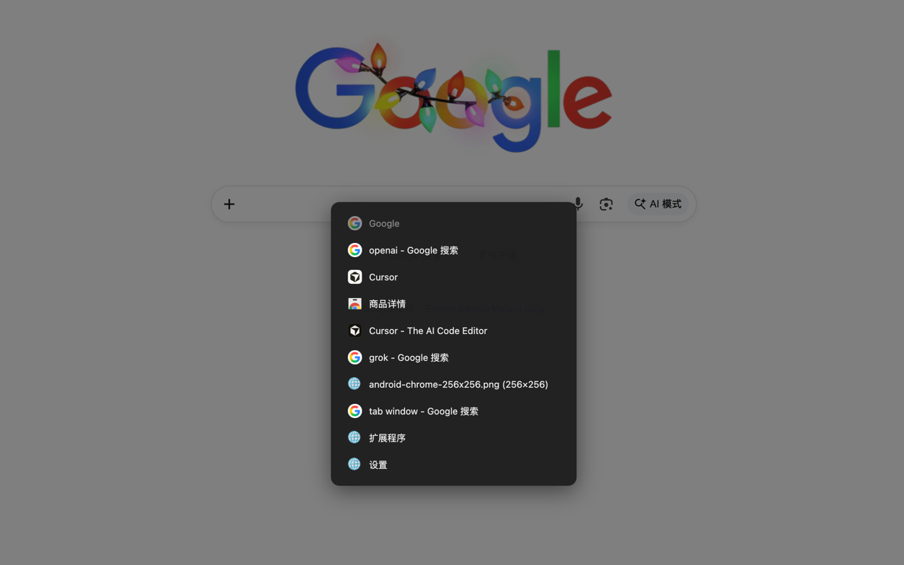

<h1 align="center">
  
  QuickTab
</h1>

<p align="center">一个轻量级的 Chrome 标签页切换器，提供快速切换体验。</p>

<p align="center">
  <a href="https://chromewebstore.google.com/detail/quicktab/pmagocpnoedekbpchligfnhkimheklaj">
    
  </a>
  
  
</p>

<p align="center">
  
</p>

## ✨ 特性

- **快速切换** — 按 Alt+Q 快速在最近标签页间切换
- **轻量无依赖** — 纯原生 JS，无需任何框架
- **隐私友好** — 数据仅存于内存，关闭浏览器自动清空
- **开箱即用** — 无需配置，安装即用

## 🎯 使用方法

| 操作 | 效果 |
|------|------|
| `Alt+Q` | 唤起切换面板 |
| `↑` `↓` 或 `Tab` | 循环选择 |
| `Enter` | 确认切换 |
| `Esc` | 取消并关闭面板 |

## 📦 安装

### 从 Chrome 应用商店安装（推荐）

直接访问 [Chrome Web Store](https://chromewebstore.google.com/detail/quicktab/pmagocpnoedekbpchligfnhkimheklaj) 点击「添加至 Chrome」即可。

### 从源码安装

1. 克隆或下载本仓库

```bash
git clone https://github.com/user/quick-tab.git
```

2. 打开 Chrome 扩展管理页面

```
chrome://extensions/
```

3. 开启右上角的「开发者模式」

4. 点击「加载已解压的扩展程序」，选择 `quick-tab` 文件夹

5. 完成！按 `Alt+Q` 开始使用

### 自定义快捷键

如果默认快捷键与其他应用冲突，可以在 Chrome 中修改：

```
chrome://extensions/shortcuts
```

## 🏗️ 技术栈

- **Manifest V3** — Chrome 扩展最新标准
- **原生 JavaScript** — 无框架依赖
- **chrome.storage.session** — 会话级存储，重启自动清空

## 🔒 权限说明

| 权限 | 用途 |
|------|------|
| `tabs` | 获取标签页标题、URL、favicon |
| `storage` | 存储最近标签列表（会话级） |
| `scripting` | 注入面板脚本 |
| `activeTab` | 访问当前标签页 |

本扩展 **不会** 收集或上传任何数据，所有信息仅在本地使用。

## 📝 开发

```bash
# 安装依赖
pnpm install

# 构建到 dist/ 目录
pnpm build

# 构建并生成 zip 包
pnpm build:zip

# 修改代码后，在 chrome://extensions/ 点击扩展的刷新按钮即可
```

### 调试

- **Service Worker 日志**：在 `chrome://extensions/` 点击「Service Worker」链接
- **Content Script 日志**：在页面的开发者工具 Console 中查看

## 🚀 自动化部署

本项目使用 GitHub Actions 实现自动化 CI/CD。

### CI 持续集成

每次推送到 `main` 分支或创建 PR 时，会自动：
- 验证 `manifest.json` 格式
- 构建并打包扩展

### 发布新版本

```bash
# 1. 更新版本号 (patch: 1.0.0 → 1.0.1)
pnpm version:patch   # 或 version:minor / version:major

# 2. 提交更改
git add .
git commit -m "chore: bump version to x.x.x"

# 3. 创建 tag 并推送
git tag v1.0.1
git push origin main --tags
```

推送 tag 后，GitHub Actions 会自动：
1. 构建扩展并生成 zip 包
2. 创建 GitHub Release 并附加 zip 文件

### Chrome Web Store 自动发布（可选）

如需自动发布到 Chrome Web Store，需要配置以下 Secrets：

| Secret | 说明 |
|--------|------|
| `CHROME_EXTENSION_ID` | 扩展 ID |
| `CHROME_CLIENT_ID` | OAuth Client ID |
| `CHROME_CLIENT_SECRET` | OAuth Client Secret |
| `CHROME_REFRESH_TOKEN` | OAuth Refresh Token |

同时在仓库 Variables 中设置 `ENABLE_CHROME_PUBLISH=true` 启用。

获取 Chrome Web Store API 凭据：[官方文档](https://developer.chrome.com/docs/webstore/using-api)

## 🤝 贡献

欢迎提交 Issue 和 Pull Request！

## 📄 License

[MIT](LICENSE)

---

Made with ❤️ by Ayden 
