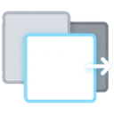

<h1 align="center">
  
  QuickTab
</h1>

<p align="center">一个轻量级的 Chrome 标签页切换器，提供快速切换体验。</p>

<p align="center">
  
  
</p>

## ✨ 特性

- **快速切换** — 按 Alt+Q 快速在最近标签页间切换
- **轻量无依赖** — 纯原生 JS，无需任何框架
- **隐私友好** — 数据仅存于内存，关闭浏览器自动清空
- **开箱即用** — 无需配置，安装即用

## 🎯 使用方法

| 操作 | 效果 |
|------|------|
| `Alt+Q` | 唤起切换面板 |
| `↑` `↓` 或 `Tab` | 循环选择 |
| `Enter` | 确认切换 |
| `Esc` | 取消并关闭面板 |

## 📦 安装

### 从源码安装

1. 克隆或下载本仓库

```bash
git clone https://github.com/user/quick-tab.git
```

2. 打开 Chrome 扩展管理页面

```
chrome://extensions/
```

3. 开启右上角的「开发者模式」

4. 点击「加载已解压的扩展程序」，选择 `quick-tab` 文件夹

5. 完成！按 `Alt+Q` 开始使用

### 自定义快捷键

如果默认快捷键与其他应用冲突，可以在 Chrome 中修改：

```
chrome://extensions/shortcuts
```

## 🏗️ 技术栈

- **Manifest V3** — Chrome 扩展最新标准
- **原生 JavaScript** — 无框架依赖
- **chrome.storage.session** — 会话级存储，重启自动清空

## 📁 项目结构

```
quick-tab/
├── manifest.json    # 扩展配置
├── background.js    # Service Worker（事件监听、数据管理）
├── content.js       # 内容脚本（UI 渲染、交互逻辑）
├── content.css      # 面板样式
├── icons/           # 扩展图标
│   ├── icon_32.png
│   ├── icon_36.png
│   ├── icon_48.png
│   └── icon_128.png
└── README.md
```

## 🔒 权限说明

| 权限 | 用途 |
|------|------|
| `tabs` | 获取标签页标题、URL、favicon |
| `storage` | 存储最近标签列表（会话级） |
| `scripting` | 注入面板脚本 |
| `activeTab` | 访问当前标签页 |

本扩展 **不会** 收集或上传任何数据，所有信息仅在本地使用。

## 📝 开发

```bash
# 修改代码后，在 chrome://extensions/ 点击扩展的刷新按钮即可
```

### 调试

- **Service Worker 日志**：在 `chrome://extensions/` 点击「Service Worker」链接
- **Content Script 日志**：在页面的开发者工具 Console 中查看

## 🤝 贡献

欢迎提交 Issue 和 Pull Request！

## 📄 License

[MIT](LICENSE)

---

Made with ❤️ by Ayden 
